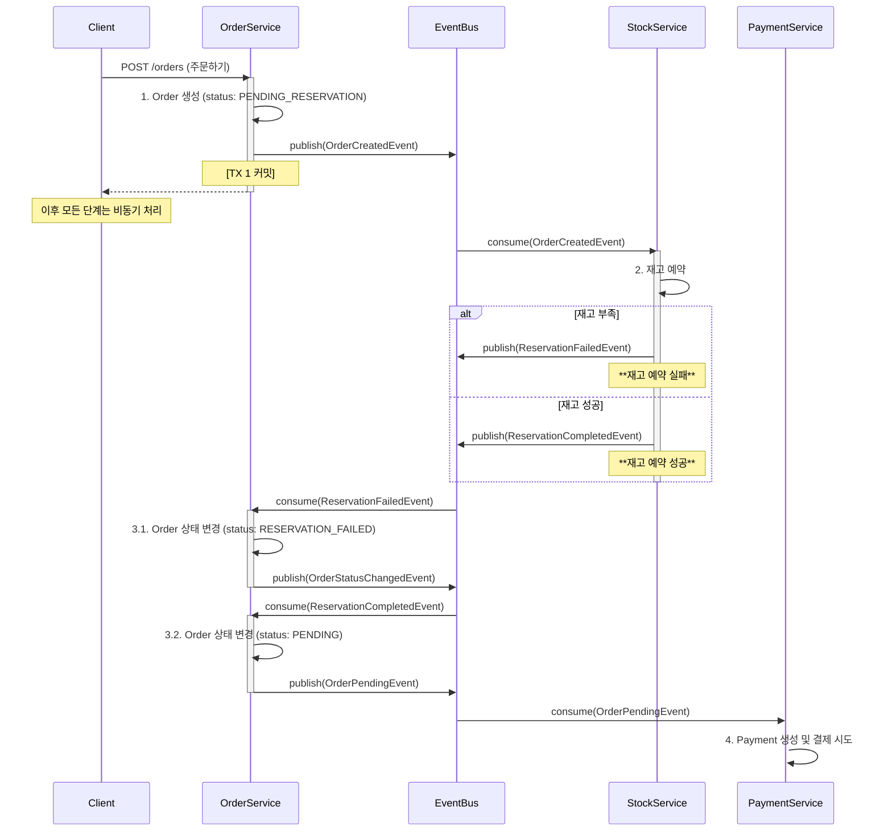
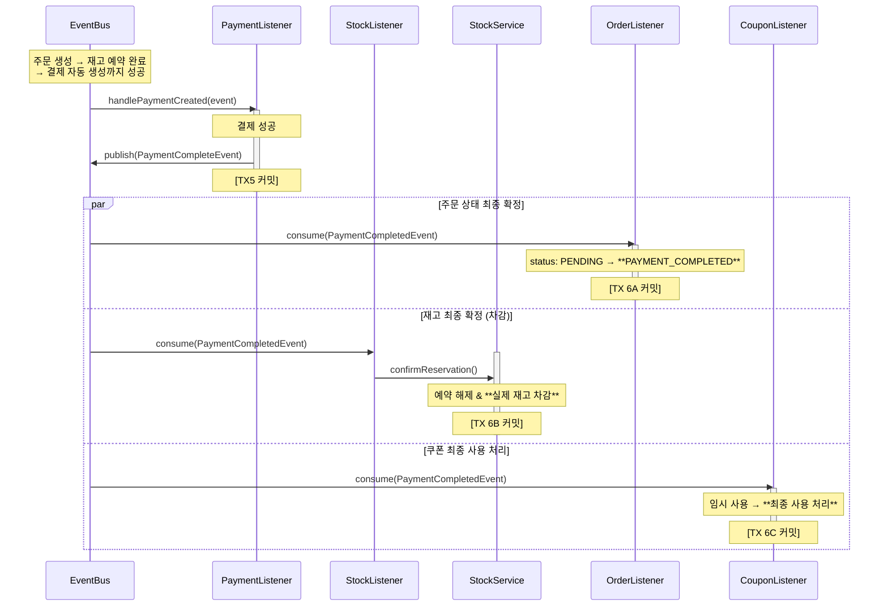
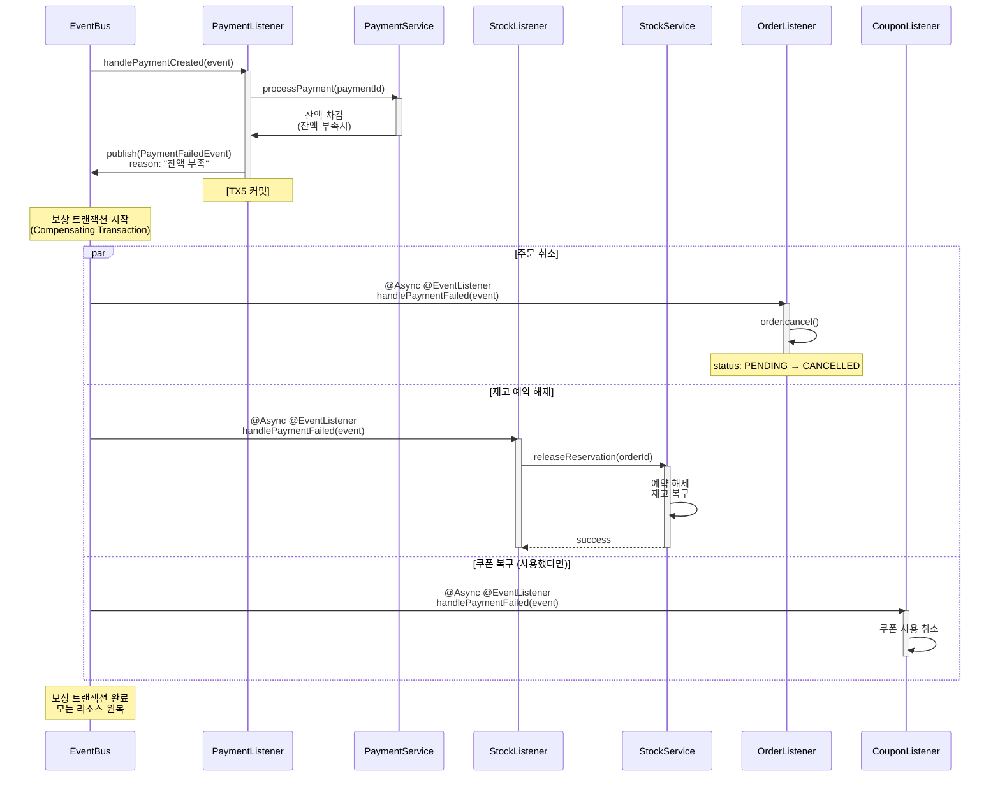

# 이벤트 기반 아키텍처 설계 문서

## 📋 목차
- [배경 및 목적](#배경-및-목적)
- [현재 아키텍처 개요](#현재-아키텍처-개요)
- [설계 결정 사항 (ADR)](#설계-결정-사항-adr)
- [주문-재고-결제 플로우](#주문-재고-결제-플로우)
- [트랜잭션 경계 및 처리 전략](#트랜잭션-경계-및-처리-전략)
- [장단점 분석](#장단점-분석)
- [MSA 전환 고려사항](#msa-전환-고려사항)

---

## 배경 및 목적

### 학습 목표
**MSA 아키텍처 패턴 학습**
-   도메인 이벤트를 통한 관심사 분리로 서비스 간 느슨한 결합(Loose Coupling) 실현
  - Monolith에서 MSA로 전환 가능한 구조 설계, 추후 Message Queue로 전환 용이한 구조

---

## 현재 아키텍처 개요

### 아키텍처 다이어그램
- 코레오그래피 방식
- 주문, 결제, 재고, 쿠폰 도메인을 분리함.
- OrderCreationOrchestrator, PaymentOrchestrator는 이름만 Orchestrator이고 실제로는 이벤트 발행만 수행하고 있음

### 핵심 컴포넌트
#### 1. Event Listener
- **역할**: 도메인 이벤트 구독 및 처리
- **구현**:
  - `StockEventListener`: 재고 예약/확정/해제
  - `OrderEventListener`: 주문 상태 변경
  - `PaymentEventListener`: 결제 처리
  - `UserCouponEventListener`: 쿠폰 사용/복구
- **특징**:
  - `@TransactionalEventListener(phase = AFTER_COMMIT)`: 트랜잭션 분리
  - 독립적인 트랜잭션 실행 (`REQUIRES_NEW`)
  - `@Async`: 비동기 처리 (선택적)

#### 2. Domain Event
- **역할**: 도메인 변경 사항 전달
- **구현**:
  - `OrderCreatedEvent`: 주문 생성
  - `ReservationCompletedEvent` : 재고 예약 완료
  - `ReservationFailedEvent` : 재고 예약 완료
  - `PaymentCreatedEvent`: 결제 생성
  - `PaymentCompletedEvent`: 결제 완료
  - `PaymentFailedEvent`: 결제 실패
- **구현 예시**:
  ```java
  public record OrderCreatedEvent(
      String eventId,
      String eventType,
      LocalDateTime occurredAt,
      String aggregateType,
      Long aggregateId,
      // ... 도메인 데이터
  ) implements DomainEvent { }
  ```

---
## 주문-재고-결제 플로우

### 주문 - 재고 - 결제 생성


### 결제
**결제 성공 시**
```
PaymentFailedEvent 발행
   ↓
StockEventListener.handlePaymentFailed()
   ↓
StockService.releaseReservation() (재고 예약 해제)

OrderEventListener.handlePaymentFailed()
   ↓
Order.status = CANCELLED (결제 실패로 인한 주문 실패)
```



**결제 실패 시**
```
PaymentFailedEvent 발행
   ↓
StockEventListener.handlePaymentFailed()
   ↓
StockService.releaseReservation() (재고 예약 해제)

OrderEventListener.handlePaymentFailed()
   ↓
Order.status = CANCELLED (결제 실패로 인한 주문 실패)
```


## 고민한 점
### 1. 데이터 일관성 및 사용자 경험 리스크

## MSA 구조의 장단점
### 1. 데이터 일관성 및 사용자 경험 리스크

## MSA 전환 고려사항

### 현재 → MSA 마이그레이션 로드맵

#### Phase 1: Monolith with Message Queue
```
┌────────────────────────────────────┐
│      Single Application (JVM)      │
│  ┌─────────────────────────────┐   │
│  │        Kafka / RabbitMQ     │ ◄─┼─ 외부 Message Broker
│  └─────────────────────────────┘   │
└────────────────────────────────────┘
```
**변경 사항**:
- `MessagePublisher` 구현을 Kafka Producer로 교체
- `@TransactionalEventListener` → Kafka Consumer로 변경
- 이벤트 영속성 확보

#### Phase 2: Microservices
```
┌──────────────┐    ┌──────────────┐    ┌──────────────┐
│ Order Service│    │ Stock Service│    │Payment Service│
└──────┬───────┘    └──────┬───────┘    └──────┬───────┘
       │                   │                   │
       └───────────────────┼───────────────────┘
                           ↓
                    ┌─────────────┐
                    │    Kafka    │
                    └─────────────┘
```
**변경 사항**:
- 각 서비스를 별도 애플리케이션으로 분리
- 독립적인 DB (Database per Service)
- API Gateway 추가
- Service Discovery (Eureka, Consul 등)
