# 이벤트 기반 아키텍처 설계 문서

## 📋 목차
- [배경 및 목적](#배경-및-목적)
- [현재 아키텍처 개요](#현재-아키텍처-개요)
- [설계 결정 사항 (ADR)](#설계-결정-사항-adr)
- [주문-재고-결제 플로우](#주문-재고-결제-플로우)
- [트랜잭션 경계 및 처리 전략](#트랜잭션-경계-및-처리-전략)
- [장단점 분석](#장단점-분석)
- [MSA 전환 고려사항](#msa-전환-고려사항)

---

## 배경 및 목적

### 학습 목표
**MSA 아키텍처 패턴 학습**
-   도메인 이벤트를 통한 관심사 분리로 서비스 간 느슨한 결합(Loose Coupling) 실현
  - Monolith에서 MSA로 전환 가능한 구조 설계, 추후 Message Queue로 전환 용이한 구조

---

## 현재 아키텍처 개요

### 아키텍처 다이어그램
- 코레오그래피 방식
- 주문, 결제, 재고, 쿠폰 도메인을 분리함.
- OrderCreationOrchestrator, PaymentOrchestrator는 이름만 Orchestrator이고 실제로는 이벤트 발행만 수행하고 있음

### 핵심 컴포넌트
#### 1. Event Listener
- **역할**: 도메인 이벤트 구독 및 처리
- **구현**:
  - `StockEventListener`: 재고 예약/확정/해제
  - `OrderEventListener`: 주문 상태 변경
  - `PaymentEventListener`: 결제 처리
  - `UserCouponEventListener`: 쿠폰 사용/복구
- **특징**:
  - `@TransactionalEventListener(phase = AFTER_COMMIT)`: 트랜잭션 분리
  - 독립적인 트랜잭션 실행 (`REQUIRES_NEW`)
  - `@Async`: 비동기 처리 (선택적)

#### 2. Domain Event
- **역할**: 도메인 변경 사항 전달
- **구현**:
  - `OrderCreatedEvent`: 주문 생성
  - `ReservationCompletedEvent` : 재고 예약 완료
  - `ReservationFailedEvent` : 재고 예약 완료
  - `PaymentCreatedEvent`: 결제 생성
  - `PaymentCompletedEvent`: 결제 완료
  - `PaymentFailedEvent`: 결제 실패
- **구현 예시**:
  ```java
  public record OrderCreatedEvent(
      String eventId,
      String eventType,
      LocalDateTime occurredAt,
      String aggregateType,
      Long aggregateId,
      // ... 도메인 데이터
  ) implements DomainEvent { }
  ```

---
## 주문-재고-결제 플로우

### 전체 시퀀스

```mermaid
sequenceDiagram
      participant Client
      participant OrderController
      participant OrderOrchestrator
      participant OrderService
      participant EventBus
      participant StockListener
      participant StockService
      participant OrderListener
      participant PaymentOrchestrator
      participant PaymentService
      participant PaymentListener

      %% 1. 주문 생성
      Client->>OrderController: POST /orders
      activate OrderController
      OrderController->>OrderOrchestrator: createOrder(request)
      activate OrderOrchestrator

      OrderOrchestrator->>OrderService: createOrderEntity(request)
      activate OrderService
      OrderService->>OrderService: Order 생성 (status: CREATED)
      OrderService-->>OrderOrchestrator: Order
      deactivate OrderService

      OrderOrchestrator->>EventBus: publish(OrderCreatedEvent)
      Note over OrderOrchestrator,EventBus: [TX1 커밋]
      OrderOrchestrator-->>OrderController: OrderResponse
      deactivate OrderOrchestrator
      OrderController-->>Client: 201 Created
      deactivate OrderController

      Note over Client: 사용자는 주문 생성만 요청<br/>이후는 자동으로 진행

      %% 2. 재고 예약 (비동기)
      EventBus->>StockListener: @EventListener<br/>handleOrderCreated(event)
      activate StockListener
      Note over StockListener: [TX2 시작 - REQUIRES_NEW]

      loop 각 주문 상품별
          StockListener->>StockService: reserve(orderId, productId, quantity)
          activate StockService
          StockService->>StockService: 재고 차감 & 예약 생성
          StockService-->>StockListener: success
          deactivate StockService
      end

      StockListener->>EventBus: publish(ReservationCompletedEvent)
      Note over StockListener,EventBus: [TX2 커밋]
      deactivate StockListener

      %% 3. 주문 상태 업데이트 (재고 예약 완료)
      EventBus->>OrderListener: @EventListener<br/>handleReservationCompleted(event)
      activate OrderListener
      Note over OrderListener: [TX3 시작 - REQUIRES_NEW]

      OrderListener->>OrderListener: order.completeReservation()
      Note over OrderListener: status: CREATED → PENDING<br/>(결제 가능 상태)

      OrderListener->>EventBus: publish(OrderStatusChangedEvent)<br/>or trigger Payment
      Note over OrderListener,EventBus: [TX3 커밋]<br/>주문 상태가 PENDING이 되면<br/>결제 자동 트리거
      deactivate OrderListener

      %% 4. 결제 자동 생성 (새로운 부분)
      EventBus->>PaymentOrchestrator: @EventListener<br/>handleOrderPending(event)
      activate PaymentOrchestrator
      Note over PaymentOrchestrator: [TX4 시작]<br/>재고 예약이 완료되었으므로<br/>자동으로 결제 생성

      PaymentOrchestrator->>PaymentService: createPayment(orderId, userId)
      activate PaymentService
      PaymentService->>PaymentService: Payment 생성<br/>(status: PENDING)
      PaymentService-->>PaymentOrchestrator: Payment
      deactivate PaymentService

      PaymentOrchestrator->>EventBus: publish(PaymentCreatedEvent)
      Note over PaymentOrchestrator,EventBus: [TX4 커밋]
      deactivate PaymentOrchestrator

      %% 5. 결제 처리
      EventBus->>PaymentListener: @EventListener<br/>handlePaymentCreated(event)
      activate PaymentListener
      Note over PaymentListener: [TX5 시작 - REQUIRES_NEW]

      PaymentListener->>PaymentService: processPayment(paymentId)
      activate PaymentService
      PaymentService->>PaymentService: 외부 PG 호출<br/>(현재: 잔액 차감)
      PaymentService->>PaymentService: payment.complete()
      PaymentService-->>PaymentListener: PaymentResult(success)
      deactivate PaymentService

      PaymentListener->>EventBus: publish(PaymentCompletedEvent)
      Note over PaymentListener,EventBus: [TX5 커밋]
      deactivate PaymentListener

      %% 6. 결제 완료 후처리 (병렬)
      par 주문 상태 업데이트
          EventBus->>OrderListener: @Async @EventListener<br/>handlePaymentCompleted(event)
          activate OrderListener
          Note over OrderListener: [TX6-A 시작]
          OrderListener->>OrderListener: order.completePayment()
          Note over OrderListener: status: PENDING → PAYMENT_COMPLETED
          Note over OrderListener: [TX6-A 커밋]
          deactivate OrderListener
      and 재고 확정
          EventBus->>StockListener: @Async @EventListener<br/>handlePaymentCompleted(event)
          activate StockListener
          Note over StockListener: [TX6-B 시작]
          StockListener->>StockService: confirmReservation()
          activate StockService
          StockService->>StockService: 예약 → 확정
          StockService-->>StockListener: success
          deactivate StockService
          Note over StockListener: [TX6-B 커밋]
          deactivate StockListener
      end

      Note over Client,StockListener: 전체 플로우 완료<br/>사용자는 주문만 생성했지만<br/>재고 예약 → 결제까지 자동 진행
```


### 보상 트랜잭션 (Compensating Transaction)

**재고 예약 실패 시**
```
ReservationFailedEvent 발행
   ↓
OrderEventListener.handleReservationFailed()
   ↓
Order.status = RESERVATION_FAILED (재고 부족으로 인한 주문 실패)
```

```mermaid
 sequenceDiagram
      participant Client
      participant OrderController
      participant OrderOrchestrator
      participant EventBus
      participant StockListener
      participant StockService
      participant OrderListener

      Client->>OrderController: POST /orders
      OrderController->>OrderOrchestrator: createOrder(request)
      OrderOrchestrator->>EventBus: publish(OrderCreatedEvent)
      Note over OrderOrchestrator: [TX1 커밋]<br/>Order 생성 완료 (status: CREATED)
      OrderOrchestrator-->>Client: 201 Created

      EventBus->>StockListener: handleOrderCreated(event)
      activate StockListener
      StockListener->>StockService: reserve(productId, quantity)
      activate StockService
      StockService->>StockService: 재고 부족 확인
      StockService-->>StockListener: throw InsufficientStockException
      deactivate StockService

      Note over StockListener: 예외를 catch하고<br/>실패 이벤트 발행
      StockListener->>EventBus: publish(ReservationFailedEvent)<br/>reason: "재고 부족"
      Note over StockListener: [TX2 커밋]<br/>예외를 throw하지 않음!
      deactivate StockListener

      EventBus->>OrderListener: handleReservationFailed(event)
      activate OrderListener
      OrderListener->>OrderListener: order.failReservation()
      Note over OrderListener: status: CREATED → RESERVATION_FAILED<br/>(결제 불가 상태)
      Note over OrderListener: [TX3 커밋]
      deactivate OrderListener

      Note over Client,OrderListener: 결제가 자동 트리거되지 않음<br/>주문은 RESERVATION_FAILED 상태로 종료
```

**결제 실패 시**
```
PaymentFailedEvent 발행
   ↓
StockEventListener.handlePaymentFailed()
   ↓
StockService.releaseReservation() (재고 예약 해제)

OrderEventListener.handlePaymentFailed()
   ↓
Order.status = CANCELLED (결제 실패로 인한 주문 실패)
```



```mermaid
sequenceDiagram
      participant EventBus
      participant PaymentListener
      participant PaymentService
      participant StockListener
      participant StockService
      participant OrderListener
      participant CouponListener

      Note over EventBus: 주문 생성 → 재고 예약 완료<br/>→ 결제 자동 생성까지 성공

      EventBus->>PaymentListener: handlePaymentCreated(event)
      activate PaymentListener
      PaymentListener->>PaymentService: processPayment(paymentId)
      activate PaymentService
      PaymentService->>PaymentService: 외부 PG 호출<br/>(잔액 부족 등)
      PaymentService->>PaymentService: payment.fail(reason)
      PaymentService-->>PaymentListener: PaymentResult(failure)
      deactivate PaymentService

      PaymentListener->>EventBus: publish(PaymentFailedEvent)<br/>reason: "잔액 부족"
      Note over PaymentListener: [TX5 커밋]
      deactivate PaymentListener

      Note over EventBus: 보상 트랜잭션 시작<br/>(Compensating Transaction)

      par 주문 취소
          EventBus->>OrderListener: @Async @EventListener<br/>handlePaymentFailed(event)
          activate OrderListener
          OrderListener->>OrderListener: order.cancel()
          Note over OrderListener: status: PENDING → CANCELLED
          deactivate OrderListener
      and 재고 예약 해제
          EventBus->>StockListener: @Async @EventListener<br/>handlePaymentFailed(event)
          activate StockListener
          StockListener->>StockService: releaseReservation(orderId)
          activate StockService
          StockService->>StockService: 예약 해제<br/>재고 복구
          StockService-->>StockListener: success
          deactivate StockService
          deactivate StockListener
      and 쿠폰 복구 (사용했다면)
          EventBus->>CouponListener: @Async @EventListener<br/>handlePaymentFailed(event)
          activate CouponListener
          CouponListener->>CouponListener: 쿠폰 사용 취소
          deactivate CouponListener
      end

      Note over EventBus: 보상 트랜잭션 완료<br/>모든 리소스 원복

```

## MSA 전환 고려사항

### 현재 → MSA 마이그레이션 로드맵

#### Phase 1: Monolith with Message Queue
```
┌────────────────────────────────────┐
│      Single Application (JVM)      │
│  ┌─────────────────────────────┐   │
│  │        Kafka / RabbitMQ     │ ◄─┼─ 외부 Message Broker
│  └─────────────────────────────┘   │
└────────────────────────────────────┘
```
**변경 사항**:
- `MessagePublisher` 구현을 Kafka Producer로 교체
- `@TransactionalEventListener` → Kafka Consumer로 변경
- 이벤트 영속성 확보

#### Phase 2: Microservices
```
┌──────────────┐    ┌──────────────┐    ┌──────────────┐
│ Order Service│    │ Stock Service│    │Payment Service│
└──────┬───────┘    └──────┬───────┘    └──────┬───────┘
       │                   │                   │
       └───────────────────┼───────────────────┘
                           ↓
                    ┌─────────────┐
                    │    Kafka    │
                    └─────────────┘
```
**변경 사항**:
- 각 서비스를 별도 애플리케이션으로 분리
- 독립적인 DB (Database per Service)
- API Gateway 추가
- Service Discovery (Eureka, Consul 등)
