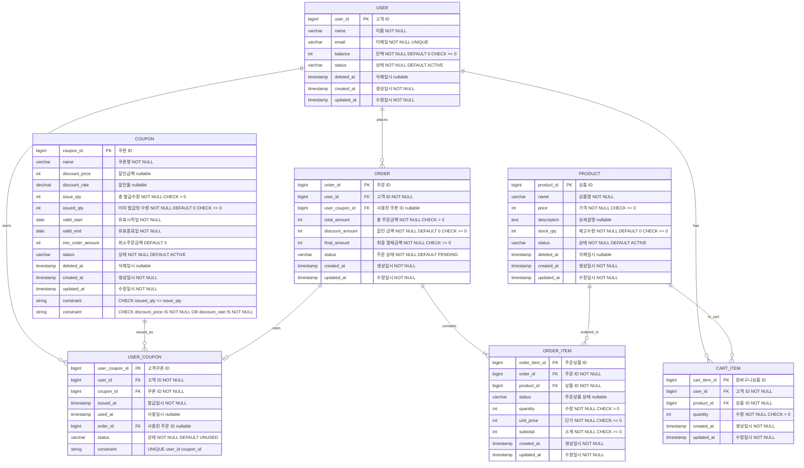

# 이커머스 - 데이터 모델

## 1. ERD



## 2. 데이터 속성

### 2.1 고객 (User)
- **고객 ID (PK)**: `bigint`, 기본키
- **이름**: `varchar(100)`, NOT NULL
- **이메일**: `varchar(255)`, NOT NULL, UNIQUE
- **잔액**: `int`, NOT NULL, DEFAULT 0, CHECK >= 0
- **상태**: `varchar(20)`, NOT NULL, DEFAULT 'ACTIVE'
  - 값: `ACTIVE` (활성), `INACTIVE` (비활성), `DELETED` (탈퇴)
- **삭제일시**: `timestamp`, nullable (소프트 딜리트)
- **생성일시**: `timestamp`, NOT NULL, DEFAULT CURRENT_TIMESTAMP
- **수정일시**: `timestamp`, NOT NULL, DEFAULT CURRENT_TIMESTAMP ON UPDATE CURRENT_TIMESTAMP

**제약 조건:**
- UNIQUE: `email`
- CHECK: `balance >= 0`

### 2.2 상품 (Product)
- **상품 ID (PK)**: `bigint`, 기본키
- **상품명**: `varchar(255)`, NOT NULL
- **가격**: `int`, NOT NULL, CHECK >= 0
- **상세 설명**: `text`, nullable
- **재고 수량**: `int`, NOT NULL, DEFAULT 0, CHECK >= 0
- **상태**: `varchar(20)`, NOT NULL, DEFAULT 'ACTIVE'
  - 값: `ACTIVE` (판매중), `INACTIVE` (판매중지), `DELETED` (삭제)
- **삭제일시**: `timestamp`, nullable (소프트 딜리트)
- **생성일시**: `timestamp`, NOT NULL, DEFAULT CURRENT_TIMESTAMP
- **수정일시**: `timestamp`, NOT NULL, DEFAULT CURRENT_TIMESTAMP ON UPDATE CURRENT_TIMESTAMP

**제약 조건:**
- CHECK: `price >= 0`
- CHECK: `stock_qty >= 0`

### 2.3 주문 (Order)
- **주문 ID (PK)**: `bigint`, 기본키
- **고객 ID (FK)**: `bigint`, NOT NULL → `USER.user_id`
- **사용된 쿠폰 ID (FK)**: `bigint`, nullable → `USER_COUPON.user_coupon_id`
- **총 주문 금액**: `int`, NOT NULL, CHECK > 0
- **할인 금액**: `int`, NOT NULL, DEFAULT 0, CHECK >= 0
- **최종 결제 금액**: `int`, NOT NULL, CHECK >= 0
- **주문 상태**: `varchar(30)`, NOT NULL, DEFAULT 'PENDING'
  - 값: `PENDING` (결제대기), `PAYMENT_COMPLETED` (결제완료), `PREPARING` (배송준비), `SHIPPED` (배송중), `DELIVERED` (배송완료), `CANCELLED` (전체취소), `PARTIALLY_CANCELLED` (부분취소), `COMPLETED` (완료)
- **생성일시**: `timestamp`, NOT NULL, DEFAULT CURRENT_TIMESTAMP
- **수정일시**: `timestamp`, NOT NULL, DEFAULT CURRENT_TIMESTAMP ON UPDATE CURRENT_TIMESTAMP

**제약 조건:**
- CHECK: `total_amount > 0`
- CHECK: `discount_amount >= 0`
- CHECK: `final_amount >= 0`
- CHECK: `final_amount = total_amount - discount_amount` (애플리케이션 레벨 검증 권장)

### 2.4 주문 상품 (OrderItem)
- **주문 상품 ID (PK)**: `bigint`, 기본키
- **주문 ID (FK)**: `bigint`, NOT NULL → `ORDER.order_id`
- **상품 ID (FK)**: `bigint`, NOT NULL → `PRODUCT.product_id`
- **주문상품 상태**: `varchar(30)`, nullable (Phase 1에서는 NULL, Phase 2에서 활성화)
  - 값: `ORDERED` (주문됨), `PREPARING` (준비중), `SHIPPED` (배송중), `DELIVERED` (배송완료), `CANCELLED` (취소), `RETURNED` (반품), `EXCHANGED` (교환)
- **수량**: `int`, NOT NULL, CHECK > 0
- **단가**: `int`, NOT NULL, CHECK >= 0 (주문 시점의 상품 가격)
- **소계**: `int`, NOT NULL, CHECK >= 0 (unit_price × quantity)
- **생성일시**: `timestamp`, NOT NULL, DEFAULT CURRENT_TIMESTAMP
- **수정일시**: `timestamp`, NOT NULL, DEFAULT CURRENT_TIMESTAMP ON UPDATE CURRENT_TIMESTAMP

**제약 조건:**
- CHECK: `quantity > 0`
- CHECK: `unit_price >= 0`
- CHECK: `subtotal >= 0`
- CHECK: `subtotal = unit_price * quantity` (애플리케이션 레벨 검증 권장)

### 2.5 쿠폰 (Coupon)
- **쿠폰 ID (PK)**: `bigint`, 기본키
- **쿠폰명**: `varchar(255)`, NOT NULL
- **할인 금액**: `int`, nullable (정액 할인)
- **할인율**: `decimal(5,2)`, nullable (정률 할인, 0~100 사이 값)
- **총 발급 수량**: `int`, NOT NULL, CHECK > 0
- **이미 발급된 수량**: `int`, NOT NULL, DEFAULT 0, CHECK >= 0
- **유효 시작일**: `date`, NOT NULL
- **유효 종료일**: `date`, NOT NULL
- **최소 주문 금액**: `int`, DEFAULT 0
- **상태**: `varchar(20)`, NOT NULL, DEFAULT 'ACTIVE'
  - 값: `ACTIVE` (활성), `INACTIVE` (비활성), `DELETED` (삭제)
- **삭제일시**: `timestamp`, nullable (소프트 딜리트)
- **생성일시**: `timestamp`, NOT NULL, DEFAULT CURRENT_TIMESTAMP
- **수정일시**: `timestamp`, NOT NULL, DEFAULT CURRENT_TIMESTAMP ON UPDATE CURRENT_TIMESTAMP

**제약 조건:**
- CHECK: `issue_qty > 0`
- CHECK: `issued_qty >= 0`
- CHECK: `issued_qty <= issue_qty`
- CHECK: `discount_price IS NOT NULL OR discount_rate IS NOT NULL` (둘 중 하나는 반드시 있어야 함)
- CHECK: `valid_start <= valid_end`

### 2.6 고객 쿠폰 (UserCoupon)
- **고객 쿠폰 ID (PK)**: `bigint`, 기본키
- **고객 ID (FK)**: `bigint`, NOT NULL → `USER.user_id`
- **쿠폰 ID (FK)**: `bigint`, NOT NULL → `COUPON.coupon_id`
- **발급 일시**: `timestamp`, NOT NULL, DEFAULT CURRENT_TIMESTAMP
- **사용 일시**: `timestamp`, nullable
- **사용된 주문 ID (FK)**: `bigint`, nullable → `ORDER.order_id`
- **상태**: `varchar(20)`, NOT NULL, DEFAULT 'UNUSED'
  - 값: `UNUSED` (미사용), `USED` (사용완료), `EXPIRED` (만료)

**제약 조건:**
- UNIQUE: `(user_id, coupon_id)` - 1인 1매 정책

### 2.7 장바구니 상품 (CartItem)
- **장바구니 상품 ID (PK)**: `bigint`, 기본키
- **고객 ID (FK)**: `bigint`, NOT NULL → `USER.user_id`
- **상품 ID (FK)**: `bigint`, NOT NULL → `PRODUCT.product_id`
- **수량**: `int`, NOT NULL, CHECK > 0
- **생성일시**: `timestamp`, NOT NULL, DEFAULT CURRENT_TIMESTAMP
- **수정일시**: `timestamp`, NOT NULL, DEFAULT CURRENT_TIMESTAMP ON UPDATE CURRENT_TIMESTAMP

**제약 조건:**
- CHECK: `quantity > 0`

## 3. 인덱스 전략

### 3.1 기본 인덱스 (PK 외)
```sql
-- USER
CREATE UNIQUE INDEX idx_user_email ON users(email);
CREATE INDEX idx_user_status ON users(status);
CREATE INDEX idx_user_deleted_at ON users(deleted_at);

-- PRODUCT
CREATE INDEX idx_product_status ON products(status);
CREATE INDEX idx_product_deleted_at ON products(deleted_at);
CREATE INDEX idx_product_status_stock ON products(status, stock_qty);

-- ORDER
CREATE INDEX idx_order_user_id ON orders(user_id);
CREATE INDEX idx_order_status ON orders(status);
CREATE INDEX idx_order_created_at ON orders(created_at DESC);
CREATE INDEX idx_order_user_coupon_id ON orders(user_coupon_id);

-- ORDER_ITEM
CREATE INDEX idx_order_item_order_id ON order_items(order_id);
CREATE INDEX idx_order_item_product_id ON order_items(product_id);

-- USER_COUPON
CREATE UNIQUE INDEX idx_user_coupon_unique ON user_coupons(user_id, coupon_id);
CREATE INDEX idx_user_coupon_user_id ON user_coupons(user_id);
CREATE INDEX idx_user_coupon_coupon_id ON user_coupons(coupon_id);
CREATE INDEX idx_user_coupon_status ON user_coupons(status);

-- COUPON
CREATE INDEX idx_coupon_status ON coupons(status);
CREATE INDEX idx_coupon_deleted_at ON coupons(deleted_at);
CREATE INDEX idx_coupon_valid_period ON coupons(valid_start, valid_end);

-- CART_ITEM
CREATE INDEX idx_cart_item_user_id ON cart_items(user_id);
CREATE INDEX idx_cart_item_product_id ON cart_items(product_id);
```

### 3.2 복합 인덱스
```sql
-- 활성 상품 조회 (재고 있는 상품)
CREATE INDEX idx_product_active_stock ON products(status, stock_qty) 
WHERE deleted_at IS NULL;

-- 사용 가능 쿠폰 조회
CREATE INDEX idx_user_coupon_user_status ON user_coupons(user_id, status);

-- 고객별 주문 조회 (최신순)
CREATE INDEX idx_order_user_created ON orders(user_id, created_at DESC);
```

## 4. 데이터 정합성 규칙

### 4.1 주문 금액 정합성
```
final_amount = total_amount - discount_amount
```
- 애플리케이션 레벨에서 저장 시 검증
- 주기적 배치 작업으로 데이터 검증

### 4.2 주문 상품 소계 정합성
```
subtotal = unit_price × quantity
```
- 애플리케이션 레벨에서 저장 시 검증

### 4.3 쿠폰 발급 수량 정합성
```
issued_qty <= issue_qty
```
- DB CHECK 제약으로 보장
- 동시성 제어로 정확성 보장 (비관적 락 또는 Redis 분산 락)

### 4.4 잔액 정합성
```
balance >= 0
```
- DB CHECK 제약으로 보장
- 결제 시 비관적 락으로 동시성 제어

## 5. 소프트 딜리트 정책

### 5.1 적용 대상
- **USER**: 고객 탈퇴 시 (주문 이력 보존)
- **PRODUCT**: 상품 삭제 시 (주문 이력 보존)
- **COUPON**: 쿠폰 삭제 시 (발급/사용 이력 보존)

### 5.2 조회 규칙
```sql
-- 활성 고객 조회
SELECT * FROM users 
WHERE status = 'ACTIVE' AND deleted_at IS NULL;

-- 활성 상품 조회
SELECT * FROM products 
WHERE status = 'ACTIVE' AND deleted_at IS NULL;

-- 삭제된 엔티티 제외
WHERE deleted_at IS NULL
```

### 5.3 삭제 처리
```sql
-- 소프트 딜리트 (물리 삭제 금지)
UPDATE users 
SET status = 'DELETED', deleted_at = CURRENT_TIMESTAMP 
WHERE user_id = ?;

UPDATE products 
SET status = 'DELETED', deleted_at = CURRENT_TIMESTAMP 
WHERE product_id = ?;

UPDATE coupons 
SET status = 'DELETED', deleted_at = CURRENT_TIMESTAMP 
WHERE coupon_id = ?;
```

## 6. 주요 비즈니스 규칙

### 6.1 쿠폰 정책
1. **1인 1매**: `(user_id, coupon_id)` UNIQUE 제약으로 보장
2. **선착순 발급**: 동시성 제어 필수 (Redis 분산 락 또는 DB 비관적 락)
3. **유효기간 검증**: 쿠폰 사용 시 `valid_start <= 현재일 <= valid_end` 확인

### 6.2 재고 관리
1. **재고 차감**: 주문 생성 시 원자적 처리 (비관적 락)
2. **재고 복원**: 주문 취소 시 자동 복원
3. **재고 부족 차단**: `stock_qty >= 주문수량` 검증

### 6.3 주문 상태 관리
1. **주문 전체 상태**: ORDER.status로 관리
2. **주문 상품 개별 상태**: ORDER_ITEM.status로 관리 (Phase 2)
3. **부분 취소**: 일부 ORDER_ITEM만 취소 가능

### 6.4 잔액 결제
1. **잔액 확인**: 결제 전 `balance >= final_amount` 검증
2. **잔액 차감**: 결제 성공 시 원자적 처리 (비관적 락)
3. **잔액 복원**: 결제 실패 또는 주문 취소 시 자동 복원

## 7. 참고 사항

### 7.1 데이터 타입
- ID: `bigint` (최대 9,223,372,036,854,775,807)
- 금액: `int` (최대 약 21억, 원화 기준 충분)

### 7.2 성능 최적화
- **계산 필드 유지**: `final_amount`, `subtotal` (조회 성능 향상)
- **인덱스 활용**: 자주 조회되는 컬럼에 인덱스 생성
- **파티셔닝 고려**: 대용량 데이터 시 주문 테이블 월별 파티셔닝

### 7.3 확장 고려사항
- **배송 정보**: Phase 2에서 배송지 테이블 추가 가능
- **결제 수단**: Phase 2에서 다양한 결제 수단 추가 가능
- **상품 옵션**: Phase 2에서 상품 옵션 테이블 추가 가능
- **리뷰/평점**: Phase 2에서 리뷰 테이블 추가 가능
