# 이커머스 - 데이터베이스 스키마

## 📑 목차

1. [ERD](#1-erd)
2. [테이블 정의](#2-테이블-정의)
3. [동시성 제어](#3-참고-사항)

## 1. ERD

```mermaid
erDiagram
	USER {
		bigint user_id PK "고객 ID"  
		varchar name "이름 NOT NULL"  
		varchar email "이메일 NOT NULL UNIQUE"  
		int balance "잔액 NOT NULL DEFAULT 0 CHECK >= 0"  
		varchar status "상태 NOT NULL DEFAULT ACTIVE"
		timestamp deleted_at "삭제일시 nullable"
		timestamp created_at "생성일시 NOT NULL"  
		timestamp updated_at "수정일시 NOT NULL"  
	}
    CART_ITEM {
		bigint cart_item_id PK "장바구니상품 ID"  
		bigint user_id FK "고객 ID NOT NULL"  
		bigint product_id FK "상품 ID NOT NULL"  
		int quantity "수량 NOT NULL CHECK > 0"  
		timestamp created_at "생성일시 NOT NULL"  
		timestamp updated_at "수정일시 NOT NULL"  
	}
	ORDER {
		bigint order_id PK "주문 ID"  
		bigint user_id FK "고객 ID NOT NULL"  
		bigint user_coupon_id FK "사용된 쿠폰 ID nullable"
		int total_amount "총 주문금액 NOT NULL CHECK > 0"  
		int discount_amount "할인 금액 NOT NULL DEFAULT 0 CHECK >= 0"  
		int final_amount "최종 결제금액 NOT NULL CHECK >= 0"  
		varchar status "주문 상태 NOT NULL DEFAULT PENDING"
		timestamp created_at "생성일시 NOT NULL"  
		timestamp updated_at "수정일시 NOT NULL"  
	}
	ORDER_ITEM {
		bigint order_item_id PK "주문상품 ID"  
		bigint order_id FK "주문 ID NOT NULL"  
		bigint product_id FK "상품 ID NOT NULL"  
		varchar status "주문상품 상태 nullable"  
		int quantity "수량 NOT NULL CHECK > 0"  
		int unit_price "단가 NOT NULL CHECK >= 0"  
		int subtotal "소계 NOT NULL CHECK >= 0"  
		timestamp created_at "생성일시 NOT NULL"
		timestamp updated_at "수정일시 NOT NULL"
	}
	USER_COUPON {
		bigint user_coupon_id PK "고객쿠폰 ID"  
		bigint user_id FK "고객 ID NOT NULL"  
		bigint coupon_id FK "쿠폰 ID NOT NULL"  
		timestamp issued_at "발급일시 NOT NULL"  
		timestamp used_at "사용일시 nullable"  
		bigint order_id FK "사용된 주문 ID nullable"  
		varchar status "상태 NOT NULL DEFAULT UNUSED"  
		string constraint "UNIQUE user_id coupon_id"
	}
	COUPON {
		bigint coupon_id PK "쿠폰 ID"  
		varchar name "쿠폰명 NOT NULL"  
		int discount_price "할인금액 nullable"  
		decimal discount_rate "할인율 nullable"  
		int issue_qty "총 발급수량 NOT NULL CHECK > 0"  
		int issued_qty "이미 발급된 수량 NOT NULL DEFAULT 0 CHECK >= 0"  
		date valid_start "유효시작일 NOT NULL"  
		date valid_end "유효종료일 NOT NULL"  
		int min_order_amount "최소주문금액 DEFAULT 0"  
		varchar status "상태 NOT NULL DEFAULT ACTIVE"
		timestamp deleted_at "삭제일시 nullable"
		timestamp created_at "생성일시 NOT NULL"
		timestamp updated_at "수정일시 NOT NULL"
		string constraint "CHECK issued_qty <= issue_qty"
		string constraint "CHECK discount_price IS NOT NULL OR discount_rate IS NOT NULL"
	}
	PRODUCT {
		bigint product_id PK "상품 ID"  
		varchar name "상품명 NOT NULL"  
		int price "가격 NOT NULL CHECK >= 0"  
		text description "상세설명 nullable"  
		int stock_qty "재고수량 NOT NULL DEFAULT 0 CHECK >= 0"  
		varchar status "상태 NOT NULL DEFAULT ACTIVE"
		timestamp deleted_at "삭제일시 nullable"
		timestamp created_at "생성일시 NOT NULL"  
		timestamp updated_at "수정일시 NOT NULL"  
	}
    USER ||--o{ ORDER : "places"
    USER ||--o{ USER_COUPON : "owns"
    USER ||--o{ CART_ITEM : "has"
    
    COUPON ||--o{ USER_COUPON : "issued_as"
    
    ORDER ||--o| USER_COUPON : "uses"
    ORDER ||--|{ ORDER_ITEM : "contains"
    
    PRODUCT ||--o{ ORDER_ITEM : "ordered_in"
    PRODUCT ||--o{ CART_ITEM : "in_cart"
```



## 2. 데이터 속성

### 2.1 고객 (User)
**고객 상태 (status)**
- `ACTIVE` (활성)
- `INACTIVE` (비활성)
- `DELETED` (탈퇴)

```sql
CREATE TABLE users (
    id BIGINT PRIMARY KEY AUTO_INCREMENT,
    name VARCHAR(100) NOT NULL COMMENT '사용자 이름',
    email VARCHAR(255) NOT NULL COMMENT '이메일',
    balance INT NOT NULL DEFAULT 0 COMMENT '잔액',
    status VARCHAR(20) NOT NULL DEFAULT 'ACTIVE' COMMENT '상태: ACTIVE, INACTIVE, DELETED',
    deleted_at TIMESTAMP NULL COMMENT '삭제일시',
    created_at TIMESTAMP NOT NULL DEFAULT CURRENT_TIMESTAMP,
    updated_at TIMESTAMP NOT NULL DEFAULT CURRENT_TIMESTAMP ON UPDATE CURRENT_TIMESTAMP,
    
    UNIQUE INDEX idx_email (email),
    INDEX idx_status (status),
    
    CONSTRAINT chk_balance CHECK (balance >= 0)
) COMMENT '사용자';
```
---
### 2.2 상품 (Product)
**상품 상태 (status)**
-  `ACTIVE` (판매중)
-  `INACTIVE` (판매중지)
-  `DELETED` (삭제)
```sql
CREATE TABLE products (
    id BIGINT PRIMARY KEY AUTO_INCREMENT,
    name VARCHAR(255) NOT NULL COMMENT '상품명',
    price INT NOT NULL COMMENT '가격',
    description TEXT COMMENT '상세 설명',
    stock_qty INT NOT NULL DEFAULT 0 COMMENT '재고 수량',
    status VARCHAR(20) NOT NULL DEFAULT 'ACTIVE' COMMENT '상태: ACTIVE, INACTIVE, DELETED',
    deleted_at TIMESTAMP NULL COMMENT '삭제일시',
    created_at TIMESTAMP NOT NULL DEFAULT CURRENT_TIMESTAMP,
    updated_at TIMESTAMP NOT NULL DEFAULT CURRENT_TIMESTAMP ON UPDATE CURRENT_TIMESTAMP,
    
    INDEX idx_status (status),
    INDEX idx_status_stock (status, stock_qty),
    
    CONSTRAINT chk_price CHECK (price >= 0),
    CONSTRAINT chk_stock CHECK (stock_qty >= 0)
) COMMENT '상품';
```

### 2.7 장바구니 상품 (CartItem)
```sql
CREATE TABLE cart_items (
    id BIGINT PRIMARY KEY AUTO_INCREMENT,
    user_id BIGINT NOT NULL COMMENT '사용자 ID',
    product_id BIGINT NOT NULL COMMENT '상품 ID',
    quantity INT NOT NULL COMMENT '수량',
    created_at TIMESTAMP NOT NULL DEFAULT CURRENT_TIMESTAMP,
    updated_at TIMESTAMP NOT NULL DEFAULT CURRENT_TIMESTAMP ON UPDATE CURRENT_TIMESTAMP,
    
    INDEX idx_user_id (user_id),
    INDEX idx_product_id (product_id),
    
    CONSTRAINT chk_quantity CHECK (quantity > 0),
    
    FOREIGN KEY (user_id) REFERENCES users(id),
    FOREIGN KEY (product_id) REFERENCES products(id)
) COMMENT '장바구니 상품';
```
---
### 2.3 주문 (Order)
**주문 상태 (status)**
- `PENDING`: 결제 대기
- `PAYMENT_COMPLETED`: 결제 완료
- `CANCELLED`: 주문 취소
```sql
CREATE TABLE orders (
    id BIGINT PRIMARY KEY AUTO_INCREMENT,
    user_id BIGINT NOT NULL COMMENT '사용자 ID',
    user_coupon_id BIGINT NULL COMMENT '사용된 쿠폰 ID',
    total_amount INT NOT NULL COMMENT '총 주문 금액',
    discount_amount INT NOT NULL DEFAULT 0 COMMENT '할인 금액',
    final_amount INT NOT NULL COMMENT '최종 결제 금액',
    status VARCHAR(30) NOT NULL DEFAULT 'PENDING' COMMENT '주문 상태',
    created_at TIMESTAMP NOT NULL DEFAULT CURRENT_TIMESTAMP,
    updated_at TIMESTAMP NOT NULL DEFAULT CURRENT_TIMESTAMP ON UPDATE CURRENT_TIMESTAMP,
    
    INDEX idx_user_id (user_id),
    INDEX idx_status (status),
    INDEX idx_created_at (created_at DESC),
    INDEX idx_user_created (user_id, created_at DESC),
    
    CONSTRAINT chk_total_amount CHECK (total_amount > 0),
    CONSTRAINT chk_discount_amount CHECK (discount_amount >= 0),
    CONSTRAINT chk_final_amount CHECK (final_amount >= 0),
    
    FOREIGN KEY (user_id) REFERENCES users(id),
    FOREIGN KEY (user_coupon_id) REFERENCES user_coupons(id)
) COMMENT '주문';
```
---
### 2.4 주문 상품 (OrderItem)
**주문 상품 상태 (status)**
- `ORDERED` (주문됨)
- `PREPARING` (준비중)
- `SHIPPED` (배송중)
- `DELIVERED` (배송완료)
- `CANCELLED` (취소)
- `RETURNED` (반품)
- `EXCHANGED` (교환)

```sql
CREATE TABLE order_items (
    id BIGINT PRIMARY KEY AUTO_INCREMENT,
    order_id BIGINT NOT NULL COMMENT '주문 ID',
    product_id BIGINT NOT NULL COMMENT '상품 ID',
    quantity INT NOT NULL COMMENT '수량',
    unit_price INT NOT NULL COMMENT '단가 (주문 시점 가격)',
    subtotal INT NOT NULL COMMENT '소계',
    status VARCHAR(20) NOT NULL DEFAULT 'ACTIVE' COMMENT '상태: ACTIVE, INACTIVE, DELETED',
    created_at TIMESTAMP NOT NULL DEFAULT CURRENT_TIMESTAMP,
    updated_at TIMESTAMP NOT NULL DEFAULT CURRENT_TIMESTAMP ON UPDATE CURRENT_TIMESTAMP,
    
    INDEX idx_order_id (order_id),
    INDEX idx_product_id (product_id),
    
    CONSTRAINT chk_quantity CHECK (quantity > 0),
    CONSTRAINT chk_unit_price CHECK (unit_price >= 0),
    CONSTRAINT chk_subtotal CHECK (subtotal >= 0),
    
    FOREIGN KEY (order_id) REFERENCES orders(id),
    FOREIGN KEY (product_id) REFERENCES products(id)
) COMMENT '주문 상품';
```
---
### 2.5 쿠폰 (Coupon)
**쿠폰 상태 (status)**
- `ACTIVE` (활성)
- `INACTIVE` (비활성)
- `DELETED` (삭제)

```sql
CREATE TABLE coupons (
    id BIGINT PRIMARY KEY AUTO_INCREMENT,
    name VARCHAR(255) NOT NULL COMMENT '쿠폰명',
    discount_price INT NULL COMMENT '할인 금액 (정액)',
    discount_rate DECIMAL(5,2) NULL COMMENT '할인율 (정률)',
    total_quantity INT NOT NULL COMMENT '총 발급 수량',
    issued_quantity INT NOT NULL DEFAULT 0 COMMENT '현재 발급된 수량',
    valid_from DATE NOT NULL COMMENT '유효 시작일',
    valid_until DATE NOT NULL COMMENT '유효 종료일',
    min_order_amount INT DEFAULT 0 COMMENT '최소 주문 금액',
    status VARCHAR(20) NOT NULL DEFAULT 'ACTIVE' COMMENT '상태: ACTIVE, INACTIVE, DELETED',
    deleted_at TIMESTAMP NULL COMMENT '삭제일시',
    created_at TIMESTAMP NOT NULL DEFAULT CURRENT_TIMESTAMP,
    updated_at TIMESTAMP NOT NULL DEFAULT CURRENT_TIMESTAMP ON UPDATE CURRENT_TIMESTAMP,
    
    INDEX idx_status (status),
    INDEX idx_valid_period (valid_from, valid_until),
    
    CONSTRAINT chk_total_quantity CHECK (total_quantity > 0),
    CONSTRAINT chk_issued_quantity CHECK (issued_quantity >= 0 AND issued_quantity <= total_quantity),
    CONSTRAINT chk_valid_period CHECK (valid_from <= valid_until)
) COMMENT '쿠폰';
```

### 2.6 고객 쿠폰 (UserCoupon)
**유저 쿠폰 상태 (status)**
- `UNUSED`: 미사용
- `USED`: 사용 완료
- `EXPIRED`: 만료

```sql
CREATE TABLE user_coupons (
    id BIGINT PRIMARY KEY AUTO_INCREMENT,
    user_id BIGINT NOT NULL COMMENT '사용자 ID',
    coupon_id BIGINT NOT NULL COMMENT '쿠폰 ID',
    issued_at TIMESTAMP NOT NULL DEFAULT CURRENT_TIMESTAMP COMMENT '발급 일시',
    used_at TIMESTAMP NULL COMMENT '사용 일시',
    order_id BIGINT NULL COMMENT '사용된 주문 ID',
    status VARCHAR(20) NOT NULL DEFAULT 'UNUSED' COMMENT '상태: UNUSED, USED, EXPIRED',
    
    UNIQUE INDEX idx_user_coupon (user_id, coupon_id) COMMENT '1인 1매 정책',
    INDEX idx_user_id (user_id),
    INDEX idx_coupon_id (coupon_id),
    INDEX idx_status (status),
    INDEX idx_user_status (user_id, status),
    
    FOREIGN KEY (user_id) REFERENCES users(id),
    FOREIGN KEY (coupon_id) REFERENCES coupons(id),
    FOREIGN KEY (order_id) REFERENCES orders(id)
) COMMENT '사용자 쿠폰';
```

## 3. 참고 사항

### 3.1 성능 최적화
- **계산 필드 유지**: `final_amount`, `subtotal` (조회 성능 향상)
- **인덱스 활용**: 자주 조회되는 컬럼에 인덱스 생성
- **파티셔닝 고려**: 대용량 데이터 시 주문 테이블 월별 파티셔닝

### 3.2 확장 고려사항
- **배송 정보**: Phase 2에서 배송지 테이블 추가 가능
- **결제 수단**: Phase 2에서 다양한 결제 수단 추가 가능
- **상품 옵션**: Phase 2에서 상품 옵션 테이블 추가 가능
- **리뷰/평점**: Phase 2에서 리뷰 테이블 추가 가능
