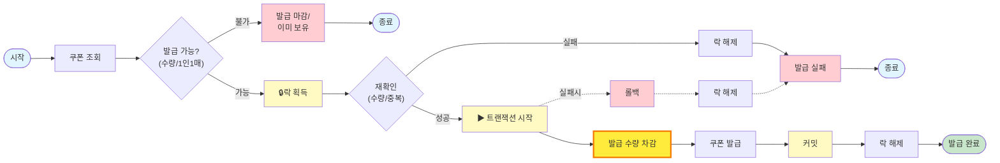
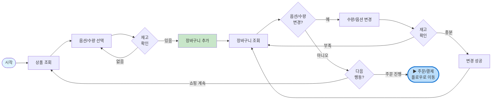

# 이커머스 - 요구사항 명세서
## 📑 목차

1. [프로젝트 개요](#1-프로젝트-개요)
2. [서비스 플로우](#2-서비스-플로우)
3. [기능 요구사항](#3-기능-요구사항)
   - 3.1 [상품 카탈로그 및 재고 관리](#31-상품-카탈로그-및-재고-관리)
   - 3.2 [장바구니](#32-장바구니)
   - 3.3 [주문 및 결제](#33-주문-및-결제)
   - 3.4 [선착순 쿠폰 시스템](#34-선착순-쿠폰-시스템)
   - 3.5 [외부 데이터 플랫폼 연동](#35-외부-데이터-플랫폼-연동)
4. [비기능 요구사항](#4-비기능-요구사항)
5. [시스템 제약사항](#5-시스템-제약사항)
6. [품질 요구사항](#6-품질-요구사항)
7. [용어 정의](#7-용어-정의)
8. [참조 문서](#8-참조-문서)
   

## 1. 프로젝트 개요

### 1.1 목적
본 문서는 이커머스 플랫폼 개발을 위한 기능 요구사항 및 비기능 요구사항을 정의합니다.

### 1.2 범위
- **대상 시스템**: 온라인 상품 판매 플랫폼
- **핵심 기능**: 상품 조회, 인기 상품 집계, 장바구니, 주문/결제, 선착순 쿠폰, 외부 데이터 연동
- **제외 사항**: 상품 관리, 배송 관리, 고객 관리, 판매자 관리

### 1.3 주요 특징
- 잔액 기반 결제 시스템
- 선착순 쿠폰 (1인 1매 정책)
- 재고 동시성 제어
- 실시간 재고 상태 표시
- 조회수/판매량 기반 인기 상품 순위 집계

---
## 2. 서비스 플로우
### 2.1 선착순 쿠폰 발급

### 2.2 상품 조회 및 장바구니 추가

### 2.3 주문 생성 및 결제

```mermaid
flowchart LR
    Start(["▶ 장바구니에서<br/>주문 진행"]) --> CreateOrder["주문 생성"]
    CreateOrder --> SelectCoupon{"쿠폰<br/>적용?"}
    
    SelectCoupon -- 예 --> ValidateCoupon{"쿠폰<br/>유효?"}
    ValidateCoupon -- 유효 --> ApplyCoupon["쿠폰 적용"]
    ValidateCoupon -- 무효 --> CheckBalance
    
    SelectCoupon -- 아니오 --> CheckBalance{"잔액<br/>확인"}
    ApplyCoupon --> CheckBalance
    
    CheckBalance -- 부족 --> CancelOrder["주문 취소"]
    CancelOrder --> End1(["종료"])
    
    CheckBalance -- 충분 --> StartTx["▶ 트랜잭션 시작"]
    StartTx --> DeductStock["재고 차감"]
    DeductStock --> DeductBalance["잔액 차감"]
    DeductBalance --> UseCoupon["쿠폰 사용 처리"]
    UseCoupon --> UpdateOrder["주문 완료 처리"]
    UpdateOrder --> ClearCart["장바구니 삭제"]
    ClearCart --> Commit["커밋"]
    
    Commit --> PaymentDone(["결제 완료"])
    PaymentDone --> SendExternal["외부 플랫폼 전송<br/>(비동기)"]
    SendExternal --> End2(["종료"])
    
    StartTx -.-> |실패시| Rollback["롤백"]
    Rollback -.-> CancelOrder
    
    style Start fill:#bbdefb,stroke:#1976d2,stroke-width:3px
    style StartTx fill:#fff9c4
    style Commit fill:#fff9c4
    style Rollback fill:#ffcdd2
    style PaymentDone fill:#c8e6c9
    style DeductStock fill:#ffeb3b,stroke:#f57c00,stroke-width:3px
    style End1 fill:#e1f5ff
    style End2 fill:#e1f5ff
```

### 핵심 프로세스

---

## 3. 기능 요구사항

### 3.1 상품 카탈로그 및 재고 관리

#### 📋 FR-1.1 상품 조회

| 요구사항 ID      | 기능       | 상세 내용                                                                                                                                          |
|--------------|----------|------------------------------------------------------------------------------------------------------------------------------------------------|
| **FR-1.1.1** | 상품 목록 조회 | • 상품명, 가격 정보 표시 • 재고 상태 정보 표시 (판매 중/품절 임박/품절) • 품절 상품 구매 불가 표시                                                                           |
| **FR-1.1.2** | 상품 상세 조회 | • 상품명, 가격, 상세 설명 표시 • 실시간 재고 상태 표시 • 품절 시 명확한 상태 표시                                                                                      |
| **FR-1.1.3** | 인기 상품 조회 | • 인기 상품 목록 • 조회수/판매량 기반으로 순위 집계   • 상품 상세 조회 : 조회 수 증가  • 결제 완료 : 판매량 증가  • 인기 점수 = (조회수 × 0.3) + (판매량 × 0.7)   • 집계 주기 : 배치 처리 | |

#### 📦 FR-1.2 재고 관리

| 요구사항 ID | 기능 | 상세 내용 |
|------------|------|----------|
| **FR-1.2.1** | 재고 상태 분류 | • **판매 중**: 재고 10개 이상 • **품절 임박**: 재고 1~9개 • **품절**: 재고 0개 |
| **FR-1.2.2** | 재고 부족 차단 | • 장바구니 담기 시 재고 확인 • 주문 생성 시 재고 재확인 • 재고 부족 시 에러 메시지 반환 |

---

### 3.2 장바구니

#### 🛒 FR-2.1 장바구니 관리

| 요구사항 ID | 기능 | 상세 내용 |
|------------|------|----------|
| **FR-2.1.1** | 장바구니 담기 | • 재고 있는 상품만 담기 가능 • 담기 시점에 재고 확인 • 동일 상품 추가 시 수량 증가 • 재고 초과 수량 차단 |
| **FR-2.1.2** | 장바구니 조회 | • 상품명, 가격, 수량, 소계 표시 • 각 상품의 현재 재고 상태 표시 • 전체 주문 금액 계산 및 표시 • 쿠폰 할인 금액 표시 (쿠폰 적용 시) |
| **FR-2.1.3** | 수량 변경 | • 수량 변경 시 재고 확인 • 재고 초과 수량 변경 차단 • 실시간 금액 업데이트 |
| **FR-2.1.4** | 상품 삭제 | • 선택 상품만 삭제 • 삭제 후 금액 업데이트 • 장바구니 비어있을 시 주문 진행 차단 |

---

### 3.3 주문 및 결제

#### 📝 FR-3.1 주문 생성

| 요구사항 ID | 기능 | 상세 내용 |
|------------|------|----------|
| **FR-3.1.1** | 주문 생성 프로세스 | • 주문 생성 시 모든 상품 재고 재확인 • 재고 부족 시 주문 생성 차단 • 재고 예약 (차감) • 주문번호 생성 • 주문 상태를 '결제대기'로 설정 • 쿠폰 적용 시 할인 금액 계산 |
| **FR-3.1.2** | 재고 원자적 처리 | • 재고 확인과 차감의 원자적 처리 (트랜잭션) • 동시 주문 시에도 재고 초과 판매 방지 • 비관적 락 또는 낙관적 락 활용 |

#### 💳 FR-3.2 잔액 기반 결제

| 요구사항 ID | 기능 | 상세 내용 |
|------------|------|----------|
| **FR-3.2.1** | 결제 처리 | • 결제 전 고객 잔액 확인 • 잔액 부족 시 결제 차단 • 결제 성공 시 잔액 차감 • 결제 성공 시 주문 상태를 '결제완료'로 변경 • 결제 성공 시 쿠폰을 '사용완료' 상태로 변경 • 결제 성공 시 재고 최종 확정 • 잔액 차감과 주문 상태 변경의 원자적 처리 |
| **FR-3.2.2** | 결제 실패 처리 | • 잔액 부족으로 결제 실패 시 재고 원복 • 결제 실패 시 쿠폰 미사용 상태로 복원 • 결제 대기 시간 초과 시 주문 자동 취소 • 실패 사유 명확히 전달 • 재고/쿠폰 복원의 원자적 처리 |

---

### 3.4 선착순 쿠폰 시스템

#### 🎟️ FR-4.1 쿠폰 발급

| 요구사항 ID | 기능 | 상세 내용 |
|------------|------|----------|
| **FR-4.1.1** | 선착순 쿠폰 발급 (1인 1매) | • 실시간 발급 가능 수량 확인 • 1인 1매 제한 검증 • 중복 발급 차단 • 쿠폰 유효기간 설정 • 발급 즉시 사용 가능 상태로 변경 • 쿠폰 소진 시 마감 안내 |
| **FR-4.1.2** | 쿠폰 발급 동시성 제어 | • 발급 수량 확인과 차감의 원자적 처리 • 1인 1매 검증과 발급의 원자적 처리 • 동시 요청 시에도 총 발급 수량 초과 방지 • 중복 발급 완벽 차단 • Redis 분산 락 또는 DB 비관적 락 활용 • 레이스 컨디션 방지 |

#### 🎫 FR-4.2 쿠폰 조회 및 사용

| 요구사항 ID | 기능 | 상세 내용 |
|------------|------|----------|
| **FR-4.2.1** | 보유 쿠폰 조회 | • 결제 단계에서 사용 가능한 쿠폰만 표시 • 쿠폰명, 할인 금액/비율, 유효기간 표시 • 현재 주문 적용 가능 여부 표시 • 사용된 쿠폰 및 만료된 쿠폰 제외 |
| **FR-4.2.2** | 쿠폰 적용 | • 사용 가능 쿠폰 선택 • 실시간 할인 금액 계산 • 쿠폰 사용 조건 검증 (최소 주문 금액 등) • 한 주문에 하나의 쿠폰만 적용 • 최종 결제 금액 표시 |
| **FR-4.2.3** | 쿠폰 사용 완료 처리 | • 결제 성공 시에만 사용 완료 처리 • 쿠폰 사용 이력 기록 (주문번호, 사용 일시) • 사용 완료 쿠폰 재사용 차단 • 결제 실패 시 쿠폰 복원 • 쿠폰 상태 변경의 원자적 처리 |
| **FR-4.2.4** | 쿠폰 유효성 검증 | • 유효기간 확인 • 사용 여부 확인 • 최소 주문 금액 조건 검증 • 적용 가능 상품 확인 • 쿠폰 소유자 확인 • 검증 실패 시 실패 사유 반환 • 검증 과정의 원자적 처리 |

---

### 3.5 외부 데이터 플랫폼 연동

#### 🔗 FR-5.1 이벤트 데이터 전송

| 요구사항 ID | 전송 이벤트 | 포함 데이터 |
|------------|----------|----------|
| **FR-5.1.1** | 주문 생성 이벤트 | 주문번호, 상품ID, 수량, 금액, 타임스탬프 |
| **FR-5.1.1** | 결제 완료 이벤트 | 주문번호, 결제 금액, 결제 방식, 타임스탬프 |
| **FR-5.1.1** | 쿠폰 발급 이벤트 | 쿠폰ID, 고객ID, 타임스탬프 |
| **FR-5.1.1** | 쿠폰 사용 이벤트 | 쿠폰ID, 주문번호, 할인 금액, 타임스탬프 |

**전송 규칙:**
- ✅ 비동기 전송
- ✅ 전송 실패 시 최대 3회 재시도
- ✅ 전송 실패가 비즈니스 로직 차단 금지

---

## 4. 비기능 요구사항

### 4.1 성능 요구사항

#### ⚡ NFR-1.1 응답 시간

| 기능 | 목표 응답 시간 |
|------|--------------|
| 상품 목록 조회 | 평균 200ms 이하 |
| 상품 상세 조회 | 평균 150ms 이하 |
| 장바구니 작업 | 평균 300ms 이하 |
| 주문 생성 | 평균 500ms 이하 |
| 결제 처리 | 평균 1초 이하 |
| 쿠폰 발급 | 평균 300ms 이하 |

#### 📊 NFR-1.2 처리량

| 지표 | 목표 |
|------|------|
| 동시 사용자 | 최소 10,000명 처리 가능 |
| 초당 주문 생성 | 최소 1,000건 처리 가능 |
| 선착순 쿠폰 발급 | 동시 10,000건 요청 처리 가능 |

#### 📈 NFR-1.3 확장성

- ✅ 수평 확장 가능한 아키텍처
- ✅ Stateless API 서버 구조
- ✅ 데이터베이스 읽기 복제본 활용

---

### 4.2 안정성 요구사항

#### 🔒 NFR-2.1 트랜잭션 무결성

| 프로세스 | 보장 사항 |
|---------|----------|
| 재고 처리 | 재고 차감과 주문 생성의 원자성 보장 |
| 결제 처리 | 결제와 주문 상태 변경의 원자성 보장 |
| 쿠폰 처리 | 쿠폰 발급/사용의 원자성 보장 |

#### ⚠️ NFR-2.2 동시성 제어

| 대상 | 정확도 목표 |
|------|-----------|
| 재고 동시 차감 시 초과 판매 방지 | 100% |
| 선착순 쿠폰 동시 발급 시 초과 발급 방지 | 100% |
| 1인 1매 중복 발급 차단 | 100% |

#### 🛡️ NFR-2.3 에러 처리

- ✅ 모든 에러는 명확한 에러 코드와 메시지 반환
- ✅ 결제 실패 시 자동 롤백
- ✅ 타임아웃 시 자동 주문 취소

---

## 5. 시스템 제약사항

### 5.1 기술 제약사항

| 항목 | 요구사항 |
|------|----------|
| **프로그래밍 언어** | Java 17+ 또는 Kotlin 1.8+ |
| **프레임워크** | Spring Boot 3.x |
| **데이터베이스** | MySQL 8.0+ 또는 PostgreSQL 14+ |
| **캐시** | Redis 7.0+ |
| **메시지 큐** | Kafka 3.x 또는 RabbitMQ 3.x |

---

### 5.2 비즈니스 제약사항

| 정책 | 내용 |
|------|------|
| 쿠폰 정책 | 1인 1매 정책 엄격 적용 |
| 결제 방식 | 잔액 기반 결제만 지원 |
| 주문 취소 | 결제 전에만 가능 (자동 취소) |
| 결제 대기 시간 | 최대 10분 |

---

### 5.3 운영 제약사항

| 항목 | 방식 |
|------|------|
| 서비스 배포 | 무중단 배포 방식 |
| 데이터베이스 마이그레이션 | Blue-Green 방식 |
| 대규모 프로모션 | 사전 부하 테스트 필수 |

---

### 5.4 외부 시스템 연동

| 항목 | 사양 |
|------|------|
| **데이터 플랫폼** | 비동기 이벤트 전송 (Kafka/RabbitMQ) |
| **전송 포맷** | JSON |
| **재시도 정책** | 최대 3회, 지수 백오프 |

---

## 6. 품질 요구사항

### 6.1 테스트 요구사항

#### 🧪 테스트 커버리지

| 테스트 유형 | 요구사항 |
|-----------|----------|
| **단위 테스트** | 코드 커버리지 80% 이상 |
| **통합 테스트** | 주요 비즈니스 로직 시나리오 100% 커버 |

#### 📈 부하 테스트

| 시나리오 | 목표 |
|---------|------|
| 동시 재고 차감 테스트 | 1,000명 동시 처리 |
| 선착순 쿠폰 발급 테스트 | 10,000명 → 선착순 100명 |
| 결제 동시성 테스트 | 1,000명 동시 처리 |

---

### 6.2 코드 품질

- ✅ 정적 코드 분석 도구 사용
- ✅ 코드 리뷰 필수
- ✅ 컨벤션 가이드 준수

---

### 6.3 문서화

- ✅ API 문서 자동화 (Swagger/OpenAPI)
- ✅ 주요 비즈니스 로직 주석
- ✅ 아키텍처 문서 작성

---

## 7. 용어 정의

| 용어 | 정의 |
|------|------|
| **재고 예약** | 주문 생성 시 재고를 임시로 차감하여 다른 주문에서 사용할 수 없게 만드는 것 |
| **원자적 처리** | 여러 작업이 하나의 트랜잭션으로 묶여 모두 성공하거나 모두 실패하는 것 |
| **1인 1매** | 한 고객이 동일 쿠폰을 한 번만 발급받을 수 있는 정책 |
| **품절 임박** | 재고가 얼마 남지 않아 곧 품절될 것으로 예상되는 상태 (재고 1~9개) |
| **선착순 쿠폰** | 발급 수량이 제한되어 있어 먼저 신청한 사람에게만 발급되는 쿠폰 |
| **비관적 락** | 데이터 접근 시 락을 먼저 획득하여 다른 트랜잭션의 접근을 차단하는 방식 |
| **낙관적 락** | 데이터 변경 시점에 충돌을 검사하고, 충돌 시 재시도하는 방식 |
| **분산 락** | 여러 서버 간에 동기화를 위해 사용하는 락 (Redis 등 활용) |

---

## 8. 참조 문서

| 문서명 | 링크 |
|-------|------|
| 유저 스토리 문서 | [바로가기](https://github.com/crocusia/e-commerce_hanghae99/blob/feat/analyze-requirements/docs/api/user-stories.md) |
| API 설계 문서 | [바로가기](https://github.com/crocusia/e-commerce_hanghae99/blob/feat/analyze-requirements/docs/api/api-specification.md) |
| 데이터베이스 스키마 문서 | [바로가기](https://github.com/crocusia/e-commerce_hanghae99/blob/feat/analyze-requirements/docs/api/database-schema.md) |

---
