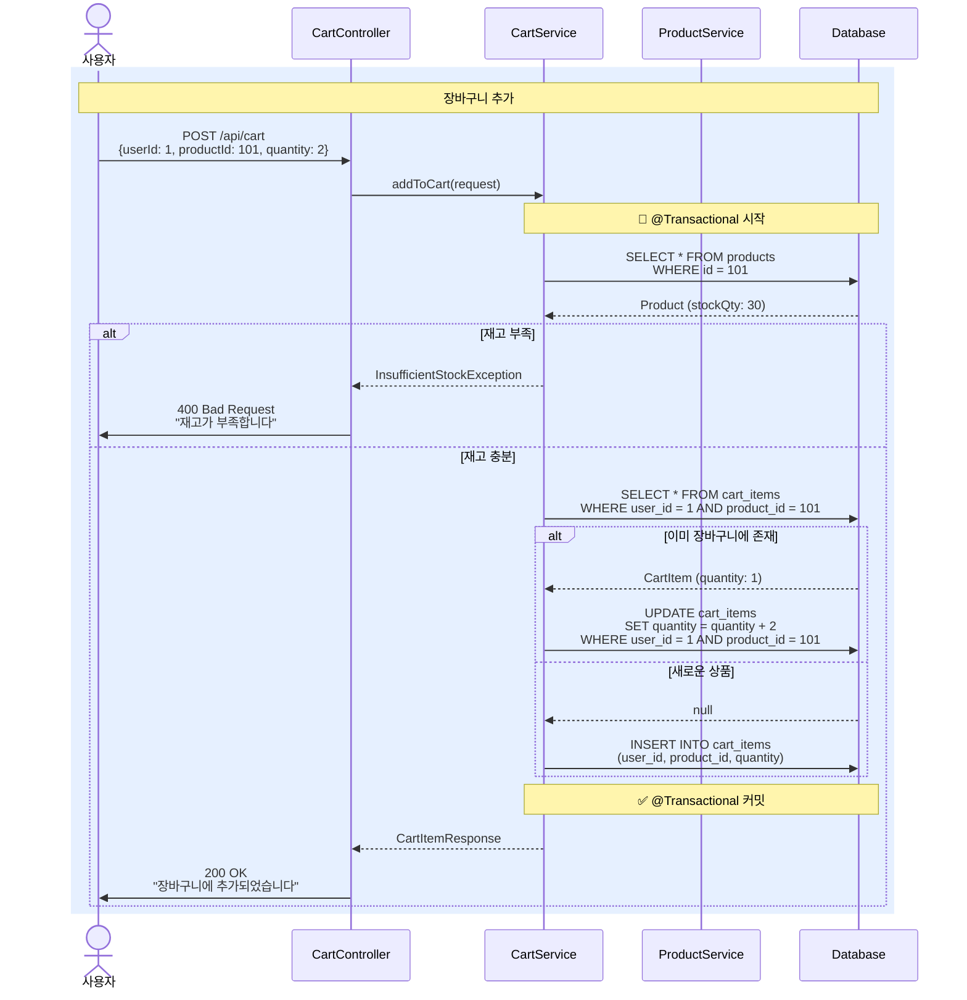
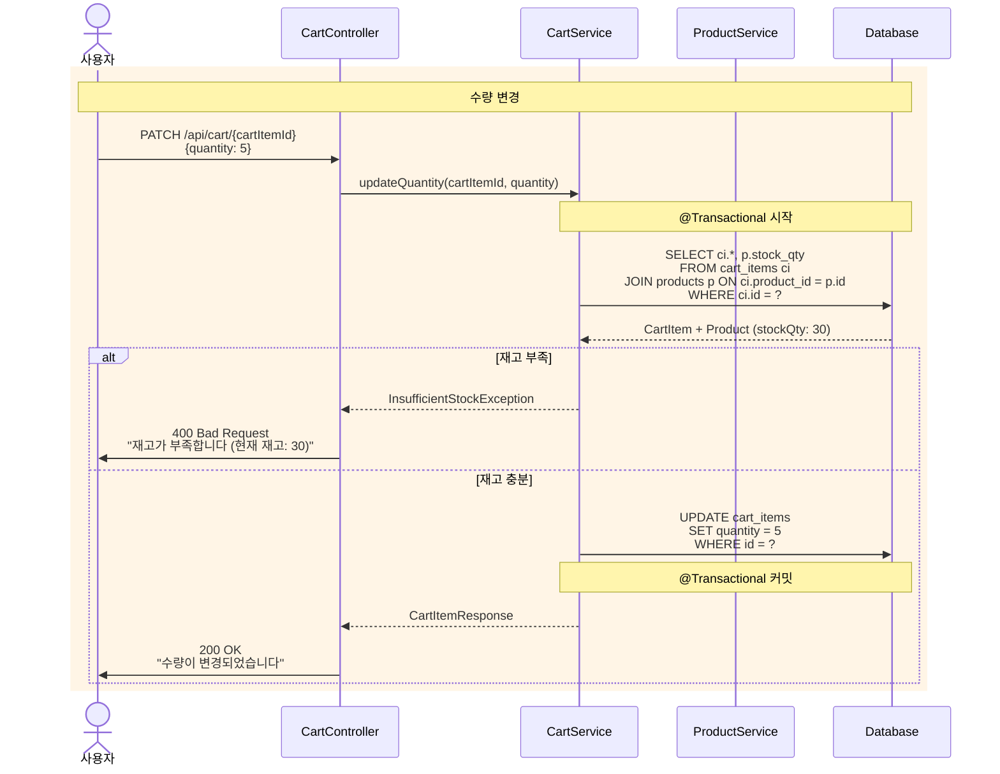
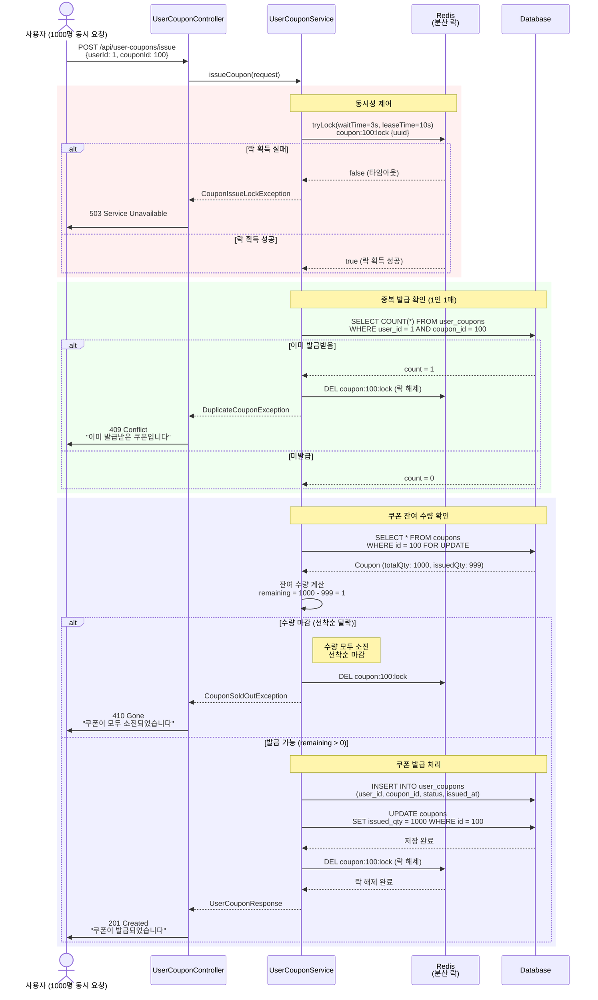
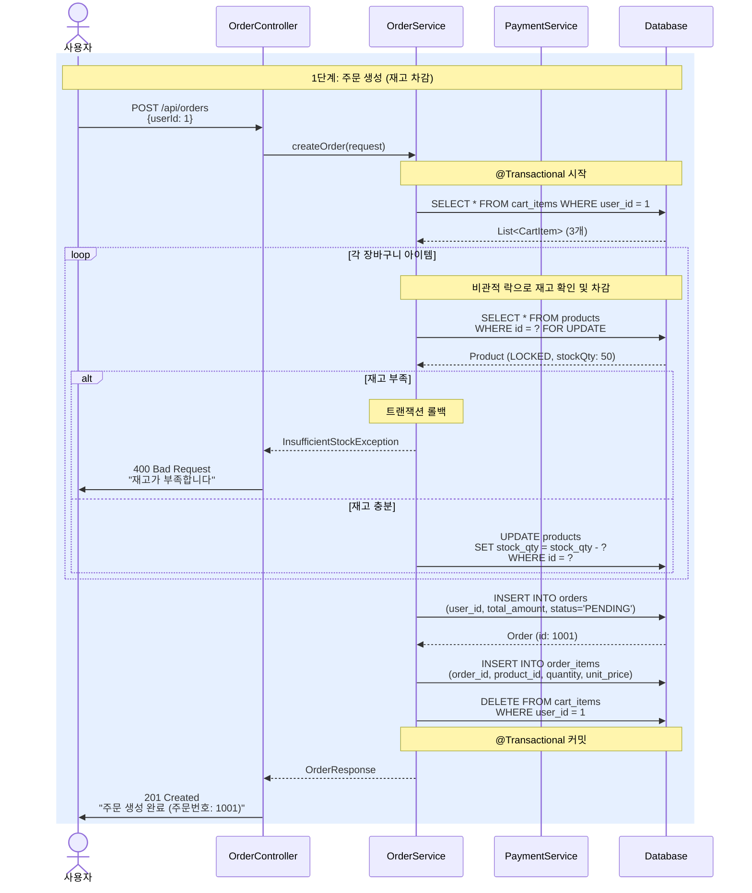
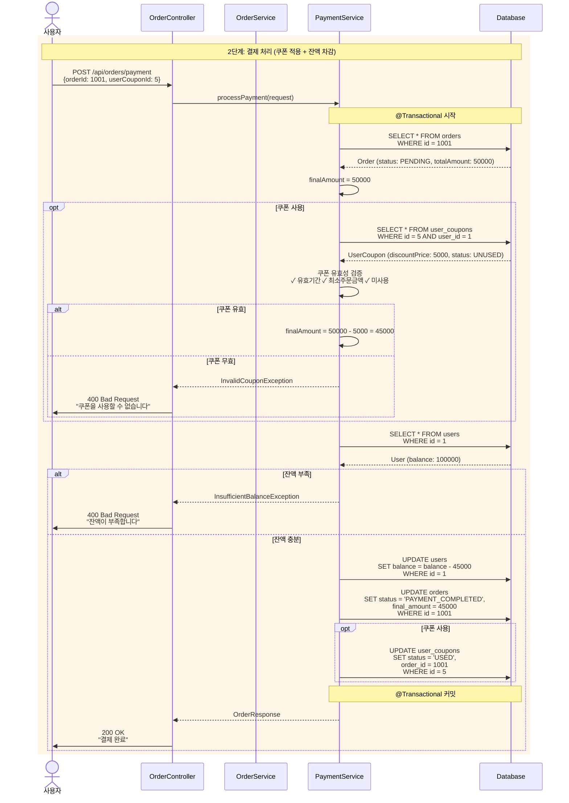

# 이커머스 플랫폼 API 시퀀스 다이어그램

## 목차
- [1. 상품 API](#1-상품-api)
- [2. 장바구니 API](#2-장바구니-api)
- [3. 쿠폰 API](#3-쿠폰-api)
- [4. 주문 및 결제 API](#4-주문-및-결제-api)
- [5. 주문 상품 관리 API](#5-주문-상품-관리-api)

---

## 1. 상품 API
### 1.1 상품 목록 조회
- `GET /api/products` 

### 1.2 상품 상세 조회
- `GET /api/products/{productId}`
 ```mermaid
sequenceDiagram
    actor User as 사용자
    participant Controller as CartController
    participant CartService as CartService
    participant ProductService as ProductService
    participant DB as Database

    rect rgb(240, 255, 240)
        Note over User,DB: 상품 조회 및 재고 확인
        
        User->>Controller: GET /api/products/{productId}
        Controller->>ProductService: getProduct(productId)
        
        ProductService->>DB: SELECT * FROM products<br/>WHERE id = ?
        DB-->>ProductService: Product (id: 101, name: "노트북",<br/>price: 1500000, stockQty: 30)
        
        ProductService-->>Controller: ProductResponse
        Controller->>User: 200 OK<br/>상품 정보 + 재고 수량
    end
``` 

---

## 2. 장바구니 API

### 주요 엔드포인트
- `GET /api/carts/{userId}` - 장바구니 조회
- `POST /api/carts/{userId}/items` - 장바구니에 상품 추가
- `PUT /api/carts/{userId}/items/{cartItemId}` - 수량 변경
- `DELETE /api/carts/{userId}/items/{cartItemId}` - 상품 삭제
- `DELETE /api/carts/{userId}` - 장바구니 전체 비우기

### 2.1 장바구니 조회
- `GET /api/carts/{userId}`

### 2.2 장바구니에 상품 추가
- `POST /api/carts/{userId}/items`


### 2.3 장바구니 수량 변경 



### 2.4 장바구니 상품 삭제
- `DELETE /api/carts/{userId}/items/{cartItemId}` - 상품 삭제

### 2.5 장바구니 삭제
- `DELETE /api/carts/{userId}` - 장바구니 전체 비우기

---

## 3. 쿠폰 API

### 3.1 쿠폰 목록 조회
- `GET /api/coupons` 
### 3.2 특정 쿠폰 상세 조회
- `GET /api/coupons/{couponId}`
### 3.3 선착순 쿠폰 발급 
- `POST /api/user-coupons/issue`



### 3.4 사용자 보유 쿠폰 조회
- `GET /api/user-coupons/users/{userId}`
### 3.5 사용자 쿠폰 상세 조회
- `GET /api/user-coupons/users/{userId}/coupons/{userCouponId}`

---

## 4. 주문 및 결제 API

### 4.1 주문 생성
- `POST /api/orders`


### 4.2 주문 목록 조회
- `GET /api/orders`
### 4.3 주문 상세 조회
- `GET /api/orders/{orderId}` 
### 4.4 주문 취소
- `POST /api/orders/{orderId}/cancel`
### 4.5 결제 처리
- `POST /api/orders/payment`


---

## 5. 주문 상품 관리 API

### 5.1 주문 상품 상세 조회
- `GET /api/order-items/{orderItemId}`
### 5.2 주문의 상품 목록 조회
- `GET /api/order-items/orders/{orderId}`
### 5.3 주문 상품 취소 
- `POST /api/order-items/{orderItemId}/cancel`
### 5.4 주문 상품 교환
- `POST /api/order-items/{orderItemId}/exchange`
### 5.5 주문 상품 반품
- `POST /api/order-items/{orderItemId}/return`
